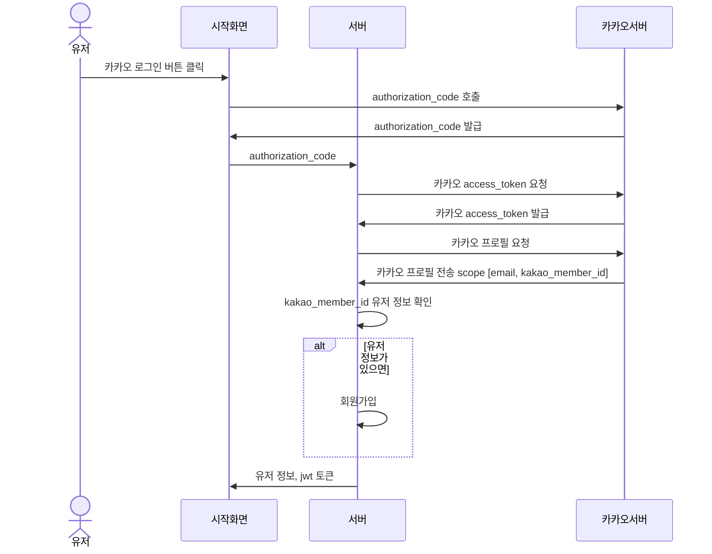
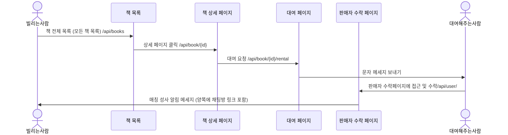

# 중고 책 대여 시스템 

### 채팅 서비스 github 링크
https://github.com/jinheung90/chatting-base

### 기술 스택
spring boot, jpa, querydsl, redis, flyway etc...

## sequenceDiagram

### 카카오 로그인 

```mermaid
sequenceDiagram
    actor 유저
    participant 시작화면
    participant 서버
    participant 카카오서버
    
    유저 ->> 시작화면: 카카오 로그인 버튼 클릭
    시작화면 ->> 카카오서버: authorization_code 호출
    카카오서버 ->> 시작화면: authorization_code 발급
    시작화면 ->> 서버: authorization_code
    서버 ->> 카카오서버: 카카오 access_token 요청
    카카오서버 ->> 서버: 카카오 access_token 발급
    서버 ->> 카카오서버: 카카오 프로필 요청
    카카오서버 ->> 서버: 카카오 프로필 전송 scope [email, kakao_member_id]
    서버 ->> 서버: kakao_member_id 유저 정보 확인
    alt 유저 정보가 있으면 
        서버 ->> 서버: 회원가입
    end
    서버 ->> 시작화면: 유저 정보, jwt 토큰
```

### 책 대여 시스템

```mermaid
sequenceDiagram
    actor borrower as 빌리는사람

    participant bookList as 책 목록
    participant bookDetail as 책 상세 페이지
    participant rental as 대여 페이지
    participant lenderAccept as 판매자 수락 페이지

    actor lender as 대여해주는사람

    borrower ->> bookList: 책 전체 목록 (모든 책 목록) /api/books
    bookList ->> bookDetail: 상세 페이지 클릭 /api/book/{id}
    bookDetail->> rental: 대여 요청 /api/book/{id}/rental
    rental ->> lender: 문자 메세지 보내기 
    lender ->> lenderAccept: 판매자 수락페이지에 접근 및 수락/api/user/
    lenderAccept ->> borrower: 매칭 성사 알림 메세지 (양쪽에 채팅방 링크 포함)
```

