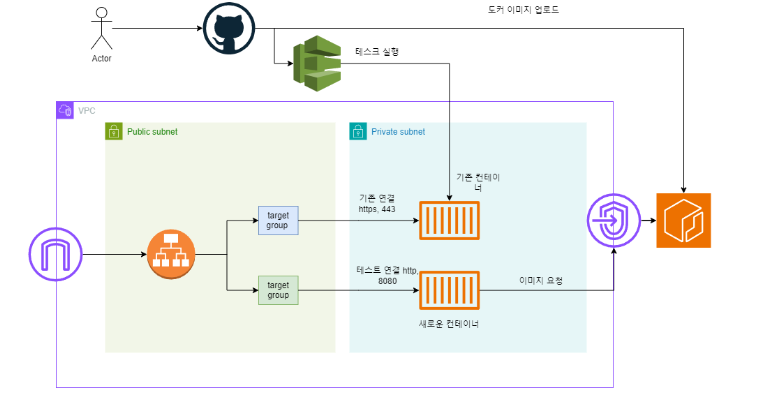

# 중고 책 대여 시스템

### 기술 스택
spring boot, jpa, querydsl, redis, elasticsearch, flyway etc...

### AWS
rds, elasticache, opensearch, ecs, ecr, parameter store, nat gateway, fargate, route53, S3, SNS ... 

### 프로젝트 폴더 구조
    - common 
    - book-cache-core
    - book-core
    - user-core
    - user-cache-core
    - main-api
    
- common
  - 공통으로 사용하는 aws, enums, util functions 등을 모아둔 곳
- user-core
  - 유저 서비스와 관련된 JPA 모듈
- user-cache-core
  - 유저 서비스와 관련된 Redis 모듈
- book-core
  - 책 서비스와 관련된 JPA, ES 모듈
- book-cache-core
  - 책 서비스와 관련된 Redis 모듈
- main-api
  - controller, scheduler를 모아놓은 모듈

### 테스트 코드 설정
@Tag로 제어 unit, integration으로 분리 하였음

### 아키텍쳐 및 배포

https://jinheung90.tistory.com/41

### 유저 서비스 README
https://github.com/jinheung90/book-rental-user-service/blob/master/user-core/README.md

### 책 서비스 README
https://github.com/jinheung90/book-rental-user-service/tree/master/book-core

### 책 유저 서비스 링크: 
https://book-service-prod.jin900920.com/api/swagger-ui/index.html

### 채팅 서비스 
https://github.com/jinheung90/book-rental-service-chat