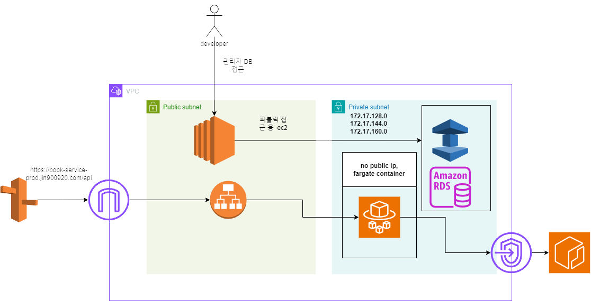
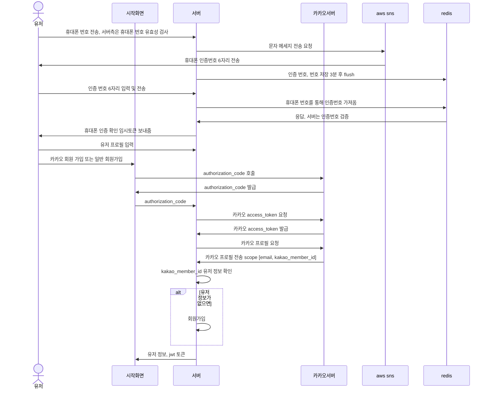

# 중고 책 대여 시스템 

### 채팅 서비스 github 링크
https://github.com/jinheung90/chatting-base

### 기술 스택
spring boot, jpa, querydsl, redis, flyway etc...

### AWS
rds, elasticache, ecs, ecr, parameter store, aws privateLink, fargate ... 

https://docs.aws.amazon.com/ko_kr/AmazonECS/latest/developerguide/networking-inbound.html

### deploy

추가 설명

배포하는 중 테스트를 하기 위한 대기 시간을 설정할 수 있으며 8080으로 테스트 한 후에 
교체가 되면 기존 연결을 바꾼다.

## sequenceDiagram

### 카카오 로그인 

