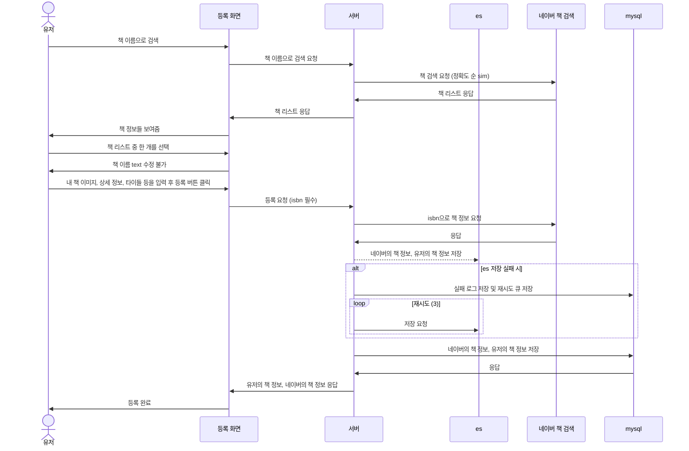

# 책 서비스
## 기능
    - 책 등록 기능
    - 책 검색 기능
    - 책 좋아요 기능
    - 책 클릭 집계 기능

## sequenceDiagram
### 책 등록 화면

## 책 검색 

### 검색 기능
    - 대여, 판매, 대여 판매로 필터 
    - 정렬 기능
        - 최신순
        - 추천순 (좋아요, 클릭 수 복합)
        - 가까운 순 (유저 프로필 주소, 현재 주소)
    - 특정 유저가 올린 책으로 검색 가능
    - 책 이름, 유저 책 타이틀 이름으로 텍스트 검색 (자모 분리 및 자동 완성기능),

## 고민한 부분

### 책 데이터를 ES, mysql 양 쪽에 저장한 이유 (CQRS)
    단점: mysql에 저장하고 ES와 동기화하는 작업으로 작업의 양이 3배 정도 늘음 
    장점: 읽기와 쓰기의 분리, 조회에 elasticsearch를 사용하므로써 검색에 최적화, 
    읽기 db의 실패 시 쓰기 db를 통해 쿼리 일종의 보험 역할을 함

### 좋아요는 왜 redis로 처리하지 않았나
    좋아요를 redis로 처리해서 캐싱하려고 했으나 즉시 반영해야할 필요가 있었음, 
    따라서 mysql에 직접 넣는것이 효율적이라고 판단

## ES

#### es 설정
    - 설치 
    https://opensearch.org/versions/opensearch-2-16-0.html
    - plugin 설치
    - .\bin\opensearch-plugin install analysis-nori (한글 형태소 분석기)
    - .\bin\opensearch-plugin install analysis-icu (자모 분리)
#### spring 설정
    - spring data elasticsearch vs spring data opensearch
    
    spring data elasticsearch가 기능이 더 많음 특히 Native query를 써야함
    spring data elasticsearch 으로 opensearch로 사용
    
    error X-Elastic-Product가 없음 
    X-Elastic-Product=Elasticsearch 헤더 추가
    {"error":"Content-Type header [application/vnd.elasticsearch+json; compatible-with=8] 
    is not supported","status":406}

    content-type application/json으로 추가

    clientConfiguration = ClientConfiguration.builder()
                    .connectedToLocalhost()
                    .withDefaultHeaders() // 여기에 넣어봤지만 작동 안함

    // 여기에 추가로 설정
    .addInterceptorLast((HttpRequestInterceptor) (request, context) ->
        request.setHeader("Content-Type", "application/json"))

## 기타

### 책 상세 클릭 수 정책
    - 30일 전 부터 오늘까지의 집계 결과
    - 클릭 복수x 2시간마다 새로 클릭 반영가능

#### 쿼리 (mysql)
    // 메인 검색 쿼리
    select
        ub1_0.id,
        ub1_0.activity,
        b1_0.id,
        b1_0.author,
        b1_0.description,
        b1_0.discount,
        b1_0.image_url,
        b1_0.isbn,
        b1_0.link,
        b1_0.pubdate,
        b1_0.publisher,
        b1_0.title,
        ub1_0.book_sell_type,
        ub1_0.created_at,
        ub1_0.detail,
        ub1_0.rent_price,
        ub1_0.book_rent_state,
        ub1_0.sell_price,
        ub1_0.title,
        ub1_0.updated_at,
        uba1_0.id,
        uba1_0.address_name,
        uba1_0.latitude,
        uba1_0.longitude,
        uba1_0.zone_no,
        ub1_0.user_id 
    from
        user_books ub1_0 
    join
        books b1_0 
            on b1_0.id=ub1_0.book_id 
    join
        user_book_addresses uba1_0 
            on uba1_0.id=ub1_0.user_book_address_id 
    where
        (
            ub1_0.book_rent_state=? 
            or ub1_0.book_rent_state=?
        ) 
        and ub1_0.activity=? 
        and (
            ub1_0.book_sell_type=? 
            or ub1_0.book_sell_type=? 
            or ub1_0.book_sell_type=?
        ) 
    order by
        ub1_0.updated_at desc 
    limit
        ?, ?
    
    // 카운트 쿼리
    select
        count(ub1_0.id) 
    from
        user_books ub1_0 
    where
        (
            ub1_0.book_rent_state=? 
            or ub1_0.book_rent_state=?
        ) 
        and ub1_0.activity=? 
        and (
            ub1_0.book_sell_type=? 
            or ub1_0.book_sell_type=? 
            or ub1_0.book_sell_type=?
        ) 
    order by
        ub1_0.updated_at desc 
    limit
        ?

    // 이미지 쿼리
    select
        ubi1_0.id,
        ubi1_0.created_at,
        ubi1_0.image_order,
        ubi1_0.image_url,
        ubi1_0.is_main,
        ubi1_0.updated_at,
        ubi1_0.user_book_id 
    from
        user_book_images ubi1_0 
    where
        ubi1_0.user_book_id in (?, ?, ?, ?, ?, ?, ?, ?, ?, ?) 
    order by
        ubi1_0.image_order

    // 좋아요 쿼리
    select
        ubl1_0.id,
        ubl1_0.activity,
        ubl1_0.created_at,
        ubl1_0.updated_at,
        ubl1_0.user_book_id,
        ubl1_0.user_id 
    from
        books_likes ubl1_0 
    where
        ubl1_0.user_book_id in (?, ?, ?, ?, ?, ?, ?, ?, ?, ?) 
        and ubl1_0.user_id=? 
        and ubl1_0.activity
    
    //유저 프로필 쿼리
    select
        u1_0.id,
        a1_0.user_id,
        a1_1.authority_name,
        u1_0.created_at,
        u1_0.is_deleted,
        u1_0.email,
        u1_0.phone,
        u1_0.updated_at,
        up1_0.id,
        up1_0.created_at,
        up1_0.nick_name,
        up1_0.profile_image_url,
        up1_0.updated_at,
        up1_0.user_id,
        us1_0.user_id,
        us1_0.user_security_id,
        us1_0.created_at,
        us1_0.email,
        us1_0.password,
        us1_0.provider,
        us1_0.social_member_id,
        us1_0.updated_at 
    from
        users u1_0 
    left join
        users_authorities a1_0 
            on u1_0.id=a1_0.user_id 
    left join
        authorities a1_1 
            on a1_1.authority_name=a1_0.authority_name 
    left join
        user_profiles up1_0 
            on u1_0.id=up1_0.user_id 
    left join
        user_securities us1_0 
            on u1_0.id=us1_0.user_id 
    where
        u1_0.id in (?, ?, ?, ?, ?, ?, ?, ?, ?, ?)