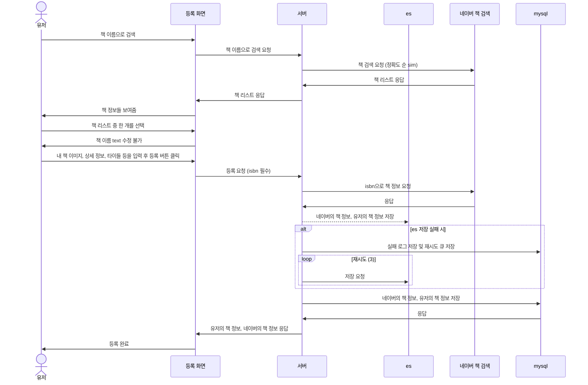

# 책 서비스

## sequenceDiagram

### 책 등록 화면

```mermaid
sequenceDiagram
        
    actor 유저
    participant 등록 화면
    participant 서버
    participant es
    participant 네이버 책 검색
    participant mysql
    
    유저 ->> 등록 화면: 책 이름으로 검색
    등록 화면 ->> 서버: 책 이름으로 검색 요청
    서버 ->> 네이버 책 검색: 책 검색 요청 (정확도 순 sim)
    네이버 책 검색->> 서버: 책 리스트 응답
    서버 ->> 등록 화면: 책 리스트 응답
    등록 화면 ->> 유저: 책 정보들 보여줌
    유저 ->> 등록 화면: 책 리스트 중 한 개를 선택
    등록 화면 ->> 유저: 책 이름 text 수정 불가
    유저 ->> 등록 화면: 내 책 이미지, 상세 정보, 타이들 등을 입력 후 등록 버튼 클릭
    등록 화면 ->> 서버: 등록 요청 (isbn 필수)
    서버 ->> 네이버 책 검색: isbn으로 책 정보 요청
    네이버 책 검색 ->> 서버: 응답
    서버 -->> es: 네이버의 책 정보, 유저의 책 정보 저장
    alt es 저장 실패 시
        서버 ->> mysql: 실패 로그 저장 및 재시도 큐 저장
        loop 재시도 (3)
           서버 ->> es: 저장 요청 
        end
    end
    서버 ->> mysql: 네이버의 책 정보, 유저의 책 정보 저장
    mysql ->> 서버: 응답
    서버 ->> 등록 화면: 유저의 책 정보, 네이버의 책 정보 응답
    등록 화면 ->> 유저: 등록 완료 
```

