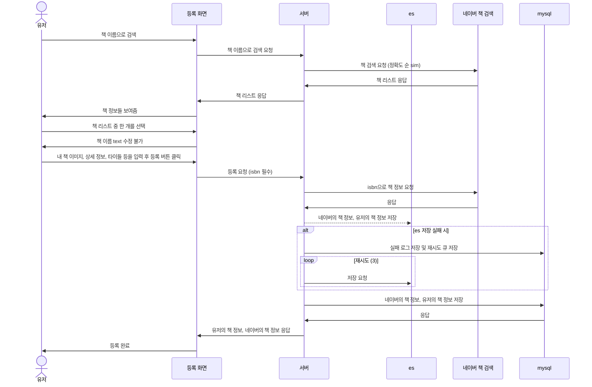

# 책 서비스
## 기능
    - 책 등록 기능
    - 책 검색 기능
    - 책 좋아요 기능
    - 책 클릭 집계 기능

## sequenceDiagram
### 책 등록 화면

## 책 검색 

### 검색 기능
    - 대여, 판매, 대여 판매로 필터 
    - 정렬 기능
        - 최신순
        - 추천순 (좋아요, 클릭 수 복합)
        - 가까운 순 (유저 프로필 주소, 현재 주소)
    - 특정 유저가 올린 책으로 검색 가능
    - 책 이름, 유저 책 타이틀 이름으로 텍스트 검색 (자모 분리 및 자동 완성기능),

## 고민한 부분

### 책 데이터를 ES, mysql 양 쪽에 저장한 이유 
    단점: mysql에 저장하고 ES와 동기화하는 작업으로 작업의 양이 3배 정도 늘음 
    장점: 요즘 AWS가 잘 되어있어서 ES가 터질일은 없지만 터졌을 때 대체가능 어쨌든 서비스가 돌아감, 
         꼭 검색이 필요하지 않은 부분에서는 ES의 부하를 줄임

### 좋아요는 왜 redis로 처리하지 않았나
    좋아요를 redis로 처리해서 캐싱하려고 했으나 즉시 반영해야할 필요가 있었음, 
    따라서 mysql에 직접 넣는것이 효율적이라고 판단

## ES

#### es 설정
    - 설치 
    https://opensearch.org/versions/opensearch-2-16-0.html
    - plugin 설치
    - .\bin\opensearch-plugin install analysis-nori (한글 형태소 분석기)
    - .\bin\opensearch-plugin install analysis-icu (자모 분리)
#### spring 설정
    - spring data elasticsearch vs spring data opensearch
    
    spring data elasticsearch가 기능이 더 많음 특히 Native query를 써야함
    spring data elasticsearch 으로 opensearch로 사용
    
    error X-Elastic-Product가 없음 
    X-Elastic-Product=Elasticsearch 헤더 추가
    {"error":"Content-Type header [application/vnd.elasticsearch+json; compatible-with=8] 
    is not supported","status":406}

    content-type application/json으로 추가

    clientConfiguration = ClientConfiguration.builder()
                    .connectedToLocalhost()
                    .withDefaultHeaders() // 여기에 넣어봤지만 작동 안함

    // 여기에 추가로 설정
    .addInterceptorLast((HttpRequestInterceptor) (request, context) ->
        request.setHeader("Content-Type", "application/json"))

## 기타

### 책 상세 클릭 수 정책
    - 30일 전 부터 오늘까지의 집계 결과
    - 클릭 복수x 2시간마다 새로 클릭 반영가능
