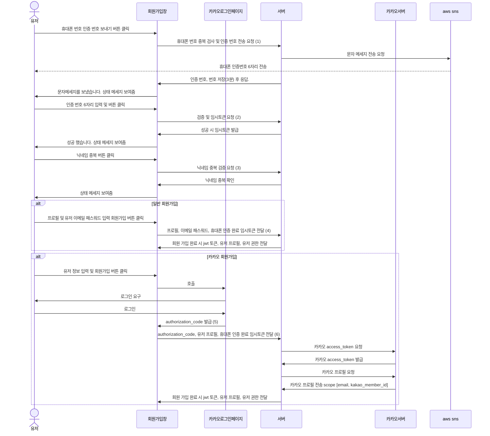

# 유저 서비스

## sequenceDiagram

### 회원가입

```mermaid
sequenceDiagram
        
    actor 유저
    participant 회원가입창
    participant 카카오로그인페이지
    participant 서버
    participant 카카오서버
    participant aws sns

    유저 ->> 회원가입창: 휴대폰 번호 인증 번호 보내기 버튼 클릭 
    회원가입창 ->> 서버: 휴대폰 번호 중복 검사 및 인증 번호 전송 요청 (1)
    서버 ->> aws sns: 문자 메세지 전송 요청 
    aws sns -->> 유저: 휴대폰 인증번호 6자리 전송
    서버 ->> 회원가입창: 인증 번호, 번호 저장(3분) 후 응답.
    회원가입창 ->> 유저: 문자메세지를 보냈습니다. 상태 메세지 보여줌
    유저 ->> 회원가입창: 인증 번호 6자리 입력 및 버튼 클릭
    회원가입창 ->> 서버: 검증 및 임시토큰 요청 (2)
    서버 ->> 회원가입창: 성공 시 임시토큰 발급 
    회원가입창 ->> 유저: 성공 했습니다. 상태 메세지 보여줌
    유저 ->> 회원가입창: 닉네임 중복 버튼 클릭 
    회원가입창 ->> 서버: 닉네임 중복 검증 요청 (3)
    서버 ->> 회원가입창: 닉네임 중복 확인 
    회원가입창 ->> 유저: 상태 메세지 보여줌
    alt 일반 회원가입
        유저 ->> 회원가입창: 프로필 및 유저 이메일 패스워드 입력 회원가입 버튼 클릭 
        회원가입창 ->> 서버: 프로필, 이메일 패스워드, 휴대폰 인증 완료 임시토큰 전달 (4)
        서버 ->> 회원가입창: 회원 가입 완료 시 jwt 토큰, 유저 프로필, 유저 권한 전달 
    end
    alt 카카오 회원가입
        유저 ->> 회원가입창: 유저 정보 입력 및 회원가입 버튼 클릭 
        회원가입창 ->> 카카오로그인페이지: 호출
        카카오로그인페이지 ->> 유저: 로그인 요구
        유저 ->> 카카오로그인페이지: 로그인
        카카오로그인페이지 ->> 회원가입창: authorization_code 발급 (5)
        회원가입창 ->> 서버: authorization_code, 유저 프로필, 휴대폰 인증 완료 임시토큰 전달 (6)
        서버 ->> 카카오서버: 카카오 access_token 요청
        카카오서버 ->> 서버: 카카오 access_token 발급
        서버 ->> 카카오서버: 카카오 프로필 요청
        카카오서버 ->> 서버: 카카오 프로필 전송 scope [email, kakao_member_id]
        서버 ->> 회원가입창: 회원 가입 완료 시 jwt 토큰, 유저 프로필, 유저 권한 전달 
    end

```

